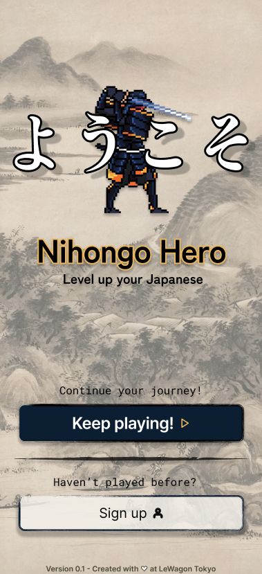
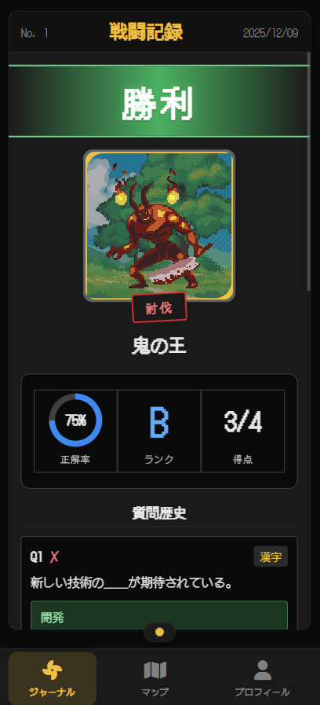

# 🗡️ Nihongo Hero

A gamified Japanese language learning app where you master vocabulary through RPG-style turn-based combat.

🔗 **Live:** [nihongohero.quest](https://nihongohero.quest)

## Screenshots

  &nbsp;&nbsp;&nbsp;&nbsp;
  &nbsp;&nbsp;&nbsp;&nbsp;
  &nbsp;&nbsp;&nbsp;&nbsp;
  &nbsp;&nbsp;&nbsp;&nbsp;
  
  

## The Problem

Traditional Japanese study apps are boring. Flashcards work, but they don't make you *want* to come back.

## The Solution

Nihongo Hero transforms language study into an RPG. Battle enemies by answering vocabulary questions — correct answers deal damage, mistakes cost health. Learning through combat.

### Features

- **Turn-based combat** — answer Japanese questions to attack enemies
- **TTS pronunciation** — hear questions spoken via VoiceVox API
- **Dynamic animations** — sword strikes, screen shake, floating damage numbers
- **Story mode** — progress through themed levels with increasing difficulty
- **Mobile-first PWA** — installable app for learning on the go
- **Leaderboard** — compete with other learners

## Tech Stack

| Category | Technologies |
|----------|--------------|
| Backend | Ruby on Rails 7 |
| Database | PostgreSQL |
| Frontend | Hotwire (Turbo + Stimulus), JavaScript, SCSS |
| Auth | Devise |
| TTS API | VoiceVox |
| Storage | Cloudinary |
| Deployment | Heroku |

## Team

Built by a team of 4 during Le Wagon Tokyo Batch #2123.

---

*Level up your Japanese. Defeat your enemies. Become a Nihongo Hero.*
